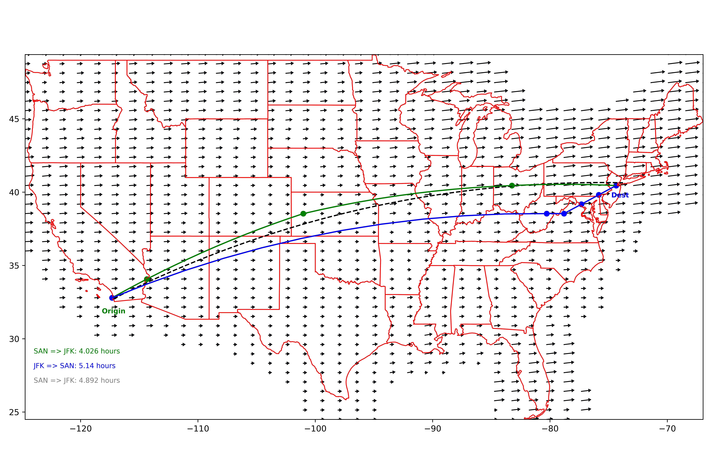

# Optimal Flight Path Calculator

This is an application that plots the most optimal flight path between an origin and destination city in the continental United States such that travel time due to distance as well as wind is minimized.

Here is an example flight path where the grid is broken into 40 points along both the longitudinal and latitudinal axes (1600 "nodes" in total).

## Summary

**Optimal Flight Path Calculator** is split into two parts: _make\_penalties\_nodes.py_ and _make\_path\_function.py_. _make\_penalties\_nodes.py_ creates the _nodes_ and _penalties\_array_ arrays needed for the path to be created, and _make\_path\_function.py_ then uses those arrays to plot the minimum path.

Each node contains information about its relative (i, j) position in the grid, the longitude and latitude at that point, the wind magnitude in the longitudinal direction, and the wind mangitude in the latitudinal direction.

_penalties\_array_ is a two dimensional array that stores the time it takes to travel from every node to every other node. Thus, if the grid is 40x40 with 1600 nodes, _penalties\_array_ has 2560000 entries. The travel time assumes a plane traveling at 500mph, and takes into account any headwind or tailwind that would alter the travel time.

Computation of the _penalties\_array_ is time intensive, so it can be calculated beforehand to be stored on the disk as a numpy array. Then, _make\_path.py_ can be run by itself to display the minimum path between any pair of cities in us-airport-codes.csv.

The algorithm used to calculate the minimum path is a modified version of Dijkstra's algorithm where the neighbor nodes are not limited to those immediately adjacent.

The application uses wind data from the Aviation Weather Center to determine the wind speed and direction at every node in the grid. Wind data at 30000 feet is only collected at certain airports across the country, so in order to define it for every node, a weighted average is taken of all the airports within a 200 mile radius.

## Requirements

    python >= 3.10

##	Dependencies
    attrs==23.1.0
    build==0.10.0
    certifi==2023.11.17
    click==8.1.7
    click-plugins==1.1.1
    cligj==0.7.2
    contourpy==1.2.0
    cycler==0.12.1
    fiona==1.9.5
    fonttools==4.47.0
    geopandas==0.14.1
    kiwisolver==1.4.5
    matplotlib==3.8.2
    numpy==1.26.2
    packaging==23.2
    pandas==2.1.4
    Pillow==10.1.0
    pip-tools==7.3.0
    pyparsing==3.1.1
    pyproj==3.6.1
    pyproject_hooks==1.0.0
    python-dateutil==2.8.2
    pytz==2023.3.post1
    scipy==1.11.4
    shapely==2.0.2
    six==1.16.0
    tzdata==2023.3
    Werkzeug==3.0.1

## Usage

    1. Clone this repo

    2. Set up the env:
        python -m venv venv
        source venv/optimal_flight_path/bin/activate
        make requirements/requirements.txt

    3. Run: (all commands are run from the _optimal_flight_path/_ directory)
        python src/make_penalties_nodes.py
        python src/make_path.py
        python src/webserver.py
        
    4. Connect to the frontend:
        Type localhost:5000 in a browser to see the frontend
